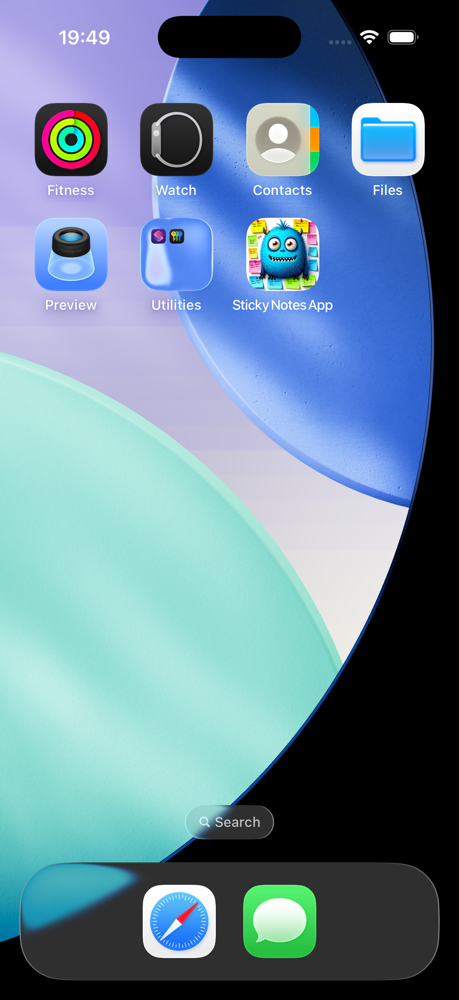
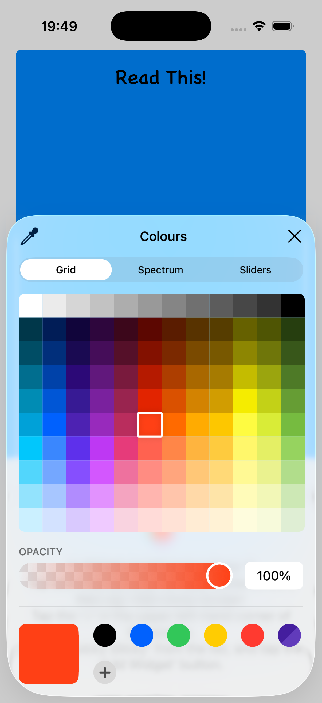
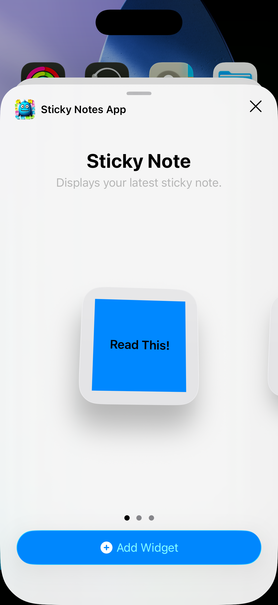

📱 Sticky Notes App (iOS)

A lightweight iOS sticky notes application built with Swift, UIKit, and WidgetKit, designed to provide fast note capture with real-time home screen widget syncing.

This project demonstrates practical iOS development skills including multi-view navigation, data persistence using shared storage, and widget integration.

✨ Key Features
- 📝 Create, edit, and delete sticky notes
- 💾 Persistent storage using UserDefaults (with App Group sharing for widget sync)
- 🧩 Home screen widget for quick note access (WidgetKit)
- 🎨 Custom UI with dynamic colour selection
- 🔄 Real-time sync between app and widget
- 📱 Multi-screen UIKit navigation with storyboard-based flow

🧠 What This Project Demonstrates
- UIKit lifecycle and view controller management
- Data persistence using UserDefaults
- Cross-target data sharing using App Groups
- WidgetKit timeline updates and widget refresh logic
- Handling user input, state updates, and UI synchronisation
- Debugging real-world Xcode + multi-target issues
- Git version control and iterative development workflow

🏗 Architecture Overview
- UI Layer: UIKit (Storyboard-based MVC)
- Persistence Layer: UserDefaults + App Group shared container
- Widget Layer: WidgetKit (timeline-based updates)
- Sync Mechanism: Shared UserDefaults + WidgetCenter.reloadAllTimelines()

🧩 Widgets

The app includes a WidgetKit extension that:

- Reads shared note data from App Group storage
- Updates on timeline refresh and manual triggers
- Displays latest note text and selected colour

## 📸 Screenshots

### App View

### Colour Editor

### Widget Preview
 

🚀 Getting Started

Clone the repository:

git clone https://github.com/GoldExMachina/Sticky-Notes-App.git

Open in Xcode:

Sticky Notes App.xcodeproj

Run on an iOS simulator or device.

🛠 Tech Stack
- Swift
- UIKit
- WidgetKit
- UserDefaults (App Groups)
- Xcode
- Core Data (stack included, not used for primary persistence)

👨‍💻 Author

Alexander Smith
iOS Developer (Learning / Portfolio Projects)
